# What is Machine Learning (ML)?

Machine learning is a general term used to apply to many techniques which utilize statistical iteration and feedback so that correlations or logic is learned rather tha dictated.

Learning itself is the act of gradually improving performance on a task without being explicitly programmed. This process mimics human neurological functions.

## [“What does the machine (i.e. the statistical model) actually learn?”](https://towardsdatascience.com/linear-regression-using-gradient-descent-in-10-lines-of-code-642f995339c0)

This will vary, but in simple terms the model learns a function f such that f(X) maps to y, where X are the features (or independent variables) and y is the target (dependent variable).  

The most basic example is simple linear regression. 

<i>y(x) = m x + b</i>

<i>m = slope</i>

<i>b = intercept (bias)</i>

By tweaking m and b, we can create a line that will best describe the relationship between x and y. How do we know we’re close? We use a cost (loss) function. A high cost value means it’s expensive — our approximation is far from describing the real relationship. On the other hand, a low cost value means it’s cheap — our approximation is close to describing the relationship.

For ML applications, there are many cost functions. For linear regression, we can use MSE.

We can't brute force our way through iterating on values for m & b. We can use something called Gradient Descent, which is the act of applying partial derivatives, with respect to both m and b, to the cost function to point us to the lowest point. 

A derivative of zero means you are at either a local minima or maxima. Which means that the closer we get to zero, the better. When we reach close to zero with our derivatives, we also get the lowest value for our cost function.

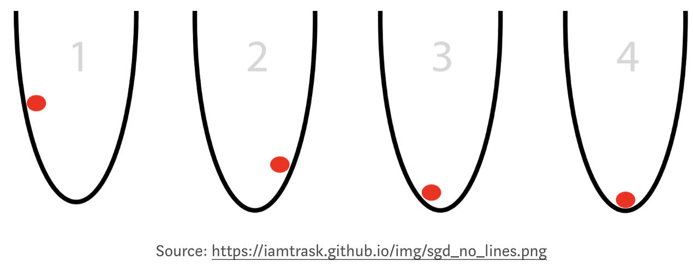


```
# adapted from https://github.com/mattnedrich/GradientDescentExample
from numpy import *
import matplotlib.pyplot as plt

# y = mx + b
# m is slope, b is y-intercept

def compute_mean_error_for_line_given_points(b, m, points):
    totalError = 0
    for i in range(0, len(points)):
        x = points[i, 0]
        y = points[i, 1]
        totalError += (y - (m * x + b)) ** 2
    return totalError / float(len(points))

def step_gradient(b_current, m_current, points, learningRate):
    b_gradient = 0
    m_gradient = 0
    N = float(len(points))
    for i in range(0, len(points)):
        x = points[i, 0]
        y = points[i, 1]
        b_gradient += -(2/N) * (y - ((m_current * x) + b_current))
        m_gradient += -(2/N) * x * (y - ((m_current * x) + b_current))
    new_b = b_current - (learningRate * b_gradient)
    new_m = m_current - (learningRate * m_gradient)
    return [new_b, new_m]

def gradient_descent_runner(points, starting_b, starting_m, learning_rate, num_iterations):
    b = starting_b
    m = starting_m
    for i in range(num_iterations):
        b, m = step_gradient(b, m, array(points), learning_rate)
        plt.plot(points[:,0],m*points[:,0]+b,'r')
        plt.pause(1)
        plt.show()    

    return [b, m]

def run():
	plt.figure()
	plt.ion()
	points = genfromtxt("../code/data.csv", delimiter=",")
	learning_rate = 0.0001
	initial_b = 0 # initial y-intercept guess
	initial_m = 0 # initial slope guess
	num_iterations = 100
	plt.axis([20, 80, 0, 150])
	plt.plot(points[:,0],points[:,1],'ob')
	plt.show()    
	print ("Starting gradient descent at b = {0}, m = {1}, error = {2}".format(initial_b, initial_m, compute_mean_error_for_line_given_points(initial_b, initial_m, points)))
	print ("Running...")
	[b, m] = gradient_descent_runner(points, initial_b, initial_m, learning_rate, num_iterations)
	print ("After {0} iterations b = {1}, m = {2}, error = {3}".format(num_iterations, b, m, compute_mean_error_for_line_given_points(b, m, points)))

if __name__ == '__main__':
    run()
```


## ML as AI

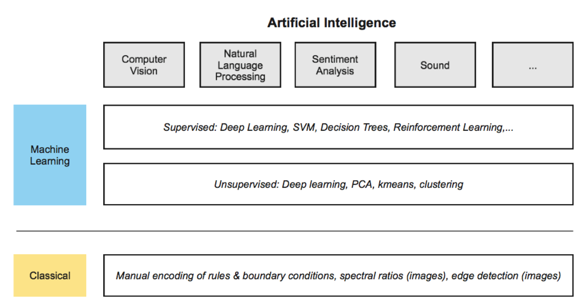

<i> Machine learning is a component of artificial intelligence (AI) (a broader subject). There are many subject areas where ML may be applied, e.g. sound, language, and vision (essentially, traits we can identify with as a human). We can differentiate between machine learning and classical techniques. </i>

## Computer Vision Applications


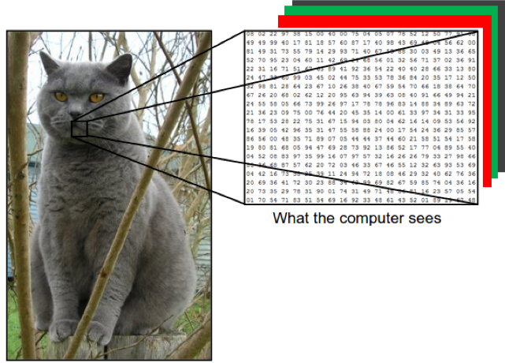

<i> Images as RGB digital counts. </i>

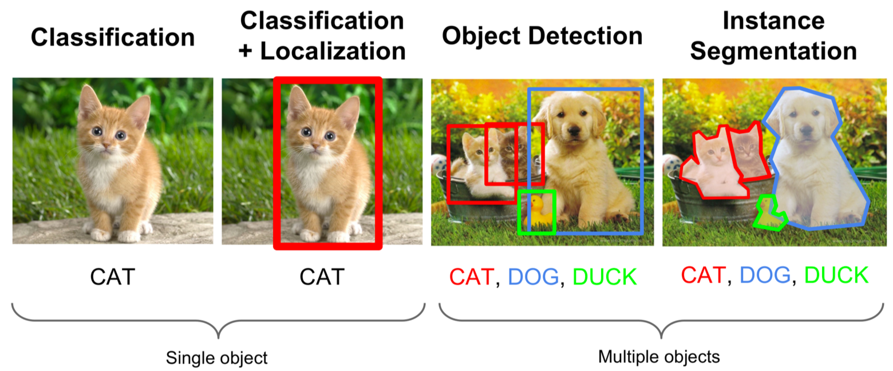

<i> Types of computer vision ML aplications. </i>

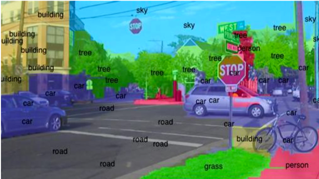

<i> Semantic segmentation is the act of labelling each individual pixel. </i>

## Supervised vs. Unsupervised


<i> Supervised classification vs. unsupervised. </i>


## ML Ethics

[Articles about bias/politics/etc](https://medium.com/@eirinimalliaraki/toward-ethical-transparent-and-fair-ai-ml-a-critical-reading-list-d950e70a70ea)

## ML Scalability

1. Making sense of pedabytes of imagery in a consistent way
1. Human feedback loop (QA/QC)

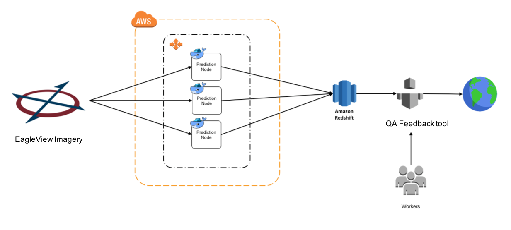


## GIS is Ideal for ML

Example Use Cases:

1. Land classification (vegetation monitoring, growth, decline, change)
1. Impervious surface
1. Change detection/anomaly
1. Geosptatial attribute trending (census, twitter)
1. Agriculture
1. Road networks
1. Object identification & tracking (ships, cars)
1. Imagery mosaicing, stitching, pre-processing
1. Resolution enhancement
1. 3D modeling & Digital Elevation/Surface Mapping
1. Coastal vegetation monitoring
1. Kringing


<i> Pedabytes of imagery may be processed repeatable, and quickly in the cloud, using ML techniques. </i>

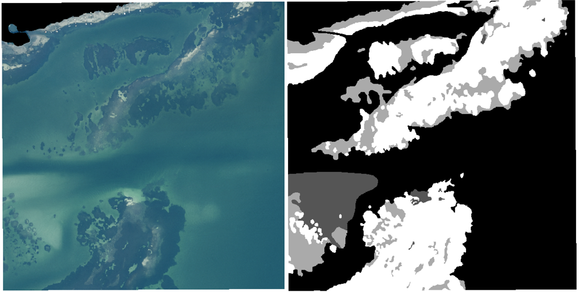

<i> FL seagrass ground truth. </i>

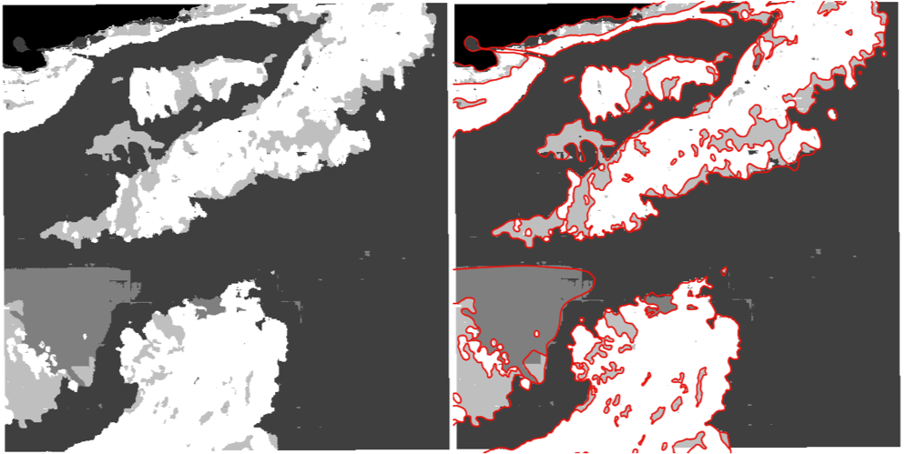

<i> FL seagrass ML prediction mapping. </i>

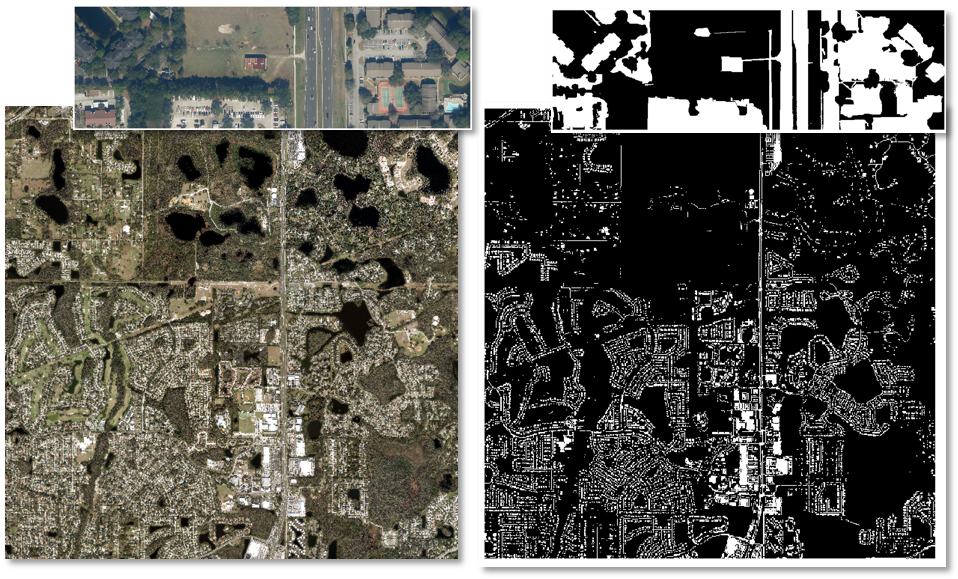

<i> Impervious surface mapping (RGB left, boolean prediction map right). </i>

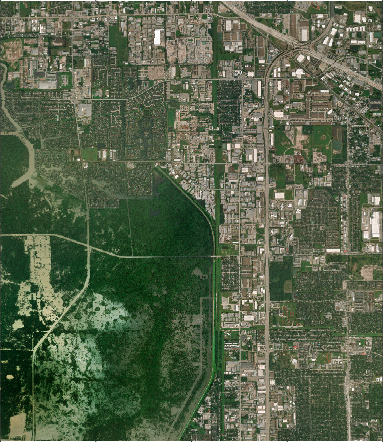
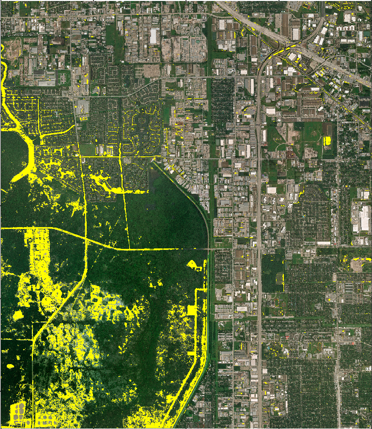

<i> Hurricane Harvey Houston flood mapping </i>

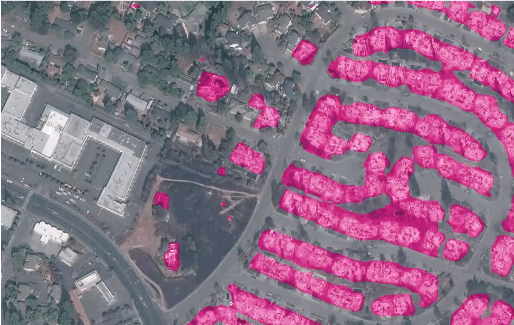

<i> Santa Rosa fire mapping </i>
