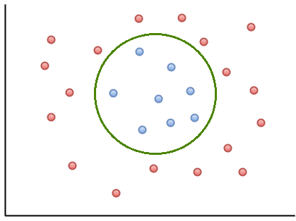

# Support vector machines (SVMs)

Support vector machines (SVMs) are a particular machine learning technique in the broader group of kernel based methods, just as random forests are one of many tree based methods. Unlike the last category, we will be focusing on this single kernel-based method.

SVMs are associated with two separate components: (1) defining a decision boundary using support vectors, and (2) transforming variables using the “kernel trick” to linearly separate classes in high dimensions.

## Support vectors and linear decision boundaries

The basics of the support vector idea can often get lost in discussion of kernels, so we’ll start with a simple example that is already linearly separable. We will relax this later.

In this simple case, each data point (or input-output pair) are labeled as one of two classes, red or blue. It’s linearly separable, so we’re able to draw a line separating the two classes perfectly. We’ll see later that in higher dimensions, the decision boundary looks like a hyperplane instead.

But there are multiple (in fact, infinite) possible decision boundaries, as we see above. All of these candidate boundaries successfully separate the training data we’re using. But we’re using machine learning not to simply classify the data in front of us, but to generalize to new data and contribute to our scientific understanding.

So how do we choose the optimal decision boundary? One intuitive criterion is maximizing the margin, i.e. the distance between the separation boundary and the points that are closest to it.

In the image above, we see the optimal decision boundary along with two dotted lines--sometimes called the supporting boundary or supporting hyperplane. Data points along those two supporting boundaries are *support vectors*, the only data points that impact the location of the boundary. So this means that the fewer the support vectors, the more generalizable the model.

## Moving SVMs to higher dimensional space

Real life situations can be much more complex. It’s rare to be able to draw a linear boundary to perfectly separate the classes. This is why we often combine support vector machines with the “kernel trick”.

If we’re allowed an infinite number of dimensions, we may be able to transform our data in a higher dimension that linearly separates the classes.

For example, the above data could be transformed using a third dimension, *z*. In the case of this circular boundary, we could consider transforming the data in the form of $z = ax^2 + by^2$.

We use machine learning to find the kernel that transforms the data in this way. The kernel trick is a computational shortcut necessary for making this task feasible. Instead of defining some kernel *K*, we search for a function *S* that we can operate in the original feature space that translates to a similarity measure of the kernel transformed data. In particular, that similarity measure is the inner product, but we won’t go in detail today.
